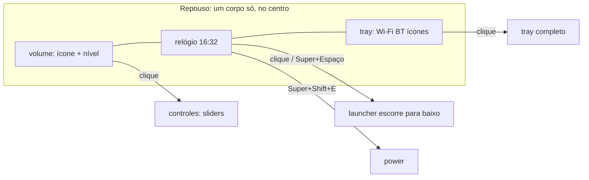

# Honey em notch: barra central, corpo que dança com a música e indicador de volume

Nada foi alterado ainda. Raiz: `pkgs/honey-shell/source/` (`S/`).

## Objetivo

1. **Notch central:** no repouso aparece só uma massa de mel no meio da tela com **volume + relógio + tray**. Os controles, o power, os wallpapers e as notificações ficam recolhidos e escorrem dela quando abertos.
2. **Sem caixa do cava:** o shell inteiro balança no ritmo da música.
3. **Indicador de volume externo:** quando o volume muda por teclas de mídia, `wpctl`, um app ou outro dispositivo, o notch mostra uma gota de volume por cerca de 1,5 s.

## Como fica

- **Largura no repouso:** cerca de 420 px (volume com 56, relógio com 180, tray com 150, mais os pescoços). Em telas `compact` (< 1400 px), uns 340 px, com o tray mostrando só os ícones de rede.
- **As três partes são um único corpo** (`HoneyTop`), com pescoços entre volume, relógio e tray. Ao abrir um painel, a parte correspondente cresce e as vizinhas são empurradas e deformadas pela fusão que já existe.
- **Painéis abrem para baixo, a partir da sua parte:** os controles saem da gota de volume, o tray da gota do tray, e o launcher, os wallpapers e as notificações do relógio, como hoje. O power, que hoje fica na ponta direita, sai do tray (o ícone de energia fica dentro do tray).
- **Cava:** sai o painel 5 e o `components/cava.plm`. `PANELS['cava']` deixa de existir. O módulo `modules.cava` passa a significar "dançar com a música".

## Balanço com a música

Hoje: `bridge.py stream` lê 12 bandas do cava, e o Luau publica `fact.energy` = média (`honey.luau:679`). A mola `audioflow` (`honey.plm:123`) mexe só a caixa do cava.

Novo:
- **Batida:** o Luau calcula `fact.beat` = média das bandas 0 a 2 (graves), com ataque rápido e queda lenta (decaimento simples no Luau, por pacote, sem escrever em `prop ~spring`). `fact.energy` continua sendo a energia geral.
- **Na cena:** a mola `groove` (rápida, pouco amortecida) segue `beat * intensity`. O `HoneyTop` recebe `groove` e:
  - pulsa a altura dos caroços da borda de baixo (+ até 6 px);
  - incha a largura total (+ até 2%);
  - dá um sacolejo horizontal de ±2 px com `noise(seed, time)` multiplicado por `energy`;
  - na batida forte (`beat > 0.7`), dispara um `impulse` numa gota que pinga.
- **Config:** `motion.groove` com valor de 0 a 1 (padrão 0.5). `0` desliga. `motion.reduced` zera tudo.
- **Custo:** o corpo redesenha enquanto há som. Sem som, a mola para e o shell fica parado como hoje. Meta: frame médio ≤ 1 ms com música tocando.

## Indicador de volume externo

- **Detecção:** o `watch("audio")` já atualiza `fact.volume` em qualquer mudança. Quem muda pelo slider passa por `on("volume_set")`, que grava `ownVolumeUntil = now + 400 ms`. Mudança que chega pelo `watch` fora dessa janela conta como **externa**.
- **Ao detectar mudança externa:**
  - `fact.volosd = 1` e um `after(1500)` com token volta a 0 (o mesmo padrão do watchdog do `request`);
  - a gota de volume no notch cresce (mola `droplet`) e mostra uma barra de mel enchendo até o nível, mais a porcentagem em Nunito;
  - o mute faz a gota escurecer, com ícone cortado.
- **Painel aberto:** se o painel de controles já estiver aberto, nada de indicador extra, porque o slider já se move sozinho.
- Também cobre as teclas de mídia (`honeyctl media volume-*`), que hoje mudam o volume sem nenhum retorno visual.

## Arquivos

| Arquivo | Mudança |
|---|---|
| `S/src/honey.plm` | nova geometria central (`volx/volw`, `clkx/clkw`, `trx/trw`); some `cavx/ctlx/pwx` da borda; molas `groove` e `volosd`; painel 5 removido; atalhos do painel apontam para as novas partes |
| `S/src/components/material.plm` | `HoneyTop` passa de 5 caixas para 3 (+ slots de toast e badge já existentes); parâmetros `groove`, `energy` e `volosd` |
| `S/src/components/volume.plm` (novo) | gota de volume: ícone, nível, porcentagem, mute |
| `S/src/components/{controls,tray,power}.plm` | origem da animação passa a ser a parte do notch |
| `S/src/components/cava.plm` | removido |
| `S/src/honey.luau` | `fact.beat` com decaimento; `ownVolumeUntil`; `volosd` com token; `request()` sem o 5 |
| `S/core/config.py` | `motion.groove` (0 a 1, validado); `cava.rate` mantido |
| `S/cli.py` | remove `PANELS['cava']` |
| `S/tests/` | testes de config (`groove`), `PANELS` e, no harness Luau, a detecção de volume externo vs. próprio e o decaimento do `beat` |
| `docs/honey.md`, `AGENTS.md` | layout notch, balanço, indicador |

## Riscos

- **Descobrir as ações:** sem a barra cheia, o power fica dentro do tray. Mitigação: o ícone de energia fica visível no próprio tray.
- **Volume oscilando:** alguns apps mudam o volume em rajadas (fade). O indicador reinicia o timer a cada mudança em vez de piscar.
- **Cava parado sem música:** já é tratado (o `bridge.py` mantém o último quadro); o `beat` decai até 0.
- **Lente e refração** num corpo que muda de largura com a música. No niri ela já está desligada (`PLEAMAR_NO_LENS=1`). No pleamar, medir.

## Verificação

1. `pleamar --check src/honey.plm`; `python3 -m unittest discover tests` (com `HONEY_LUAU` para o harness).
2. Render isolado em `mode=demo` (o cava simulado gera batida), com o shell antigo parado, conforme a regra do repositório. Capturas: repouso, cada painel aberto, indicador de volume após `wpctl set-volume @DEFAULT_AUDIO_SINK@ 5%+`.
3. Bench (`--seconds 9 --no-hud --no-vsync`) com música e sem música.
4. `nix build --no-link .#checks.x86_64-linux.honey-{pleamar-core,niri,hyprland}`.
5. Aplicar no desktop só com a sua aprovação.

## Perguntas em aberto

- O **power** fica dentro do tray, ou como uma gotinha separada colada à direita do notch?
- O **notch fica sempre visível**, ou some depois de uns segundos sem mouse por perto (auto-hide) e reaparece no hover do topo?
